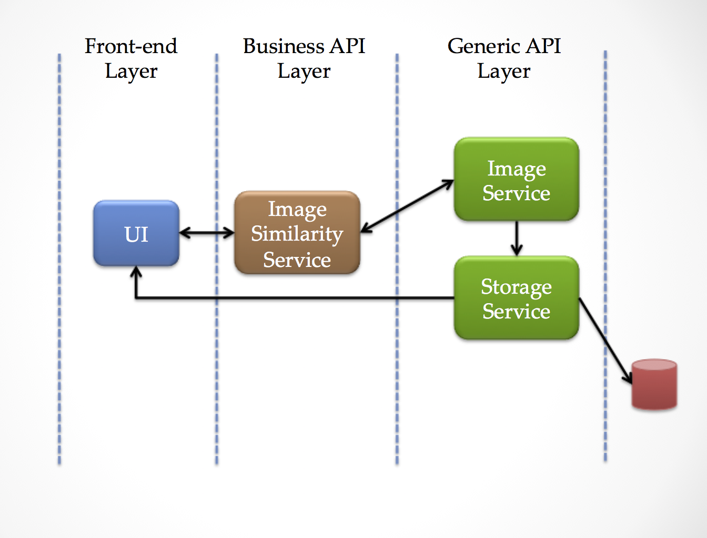

## Image Similarity Service

Here, the goal is to design and implement a scalable image similarity service. When a user uploads a new image, we should come back with n number of similar 
images already in the image repository. 

## Design

The most important goal is to reduce the image search space since this has to scale. The idea was to cluster the images so that when a new image is uploaded, the
search would be limited to the cluster that image would belong to. For clustering the images, we could use ML. But a naive way would be to come up with a hash for
each image which would match to images with similar characteristics. 

Along these lines, I decided to use a 1D histogram with 16 bins (which I call a low resolution histogram compared to a 128 or 256 bins one). The assumption here
would be that all the similar images for this would share the same histogram with 16 bins. Once a new image is uploaded an indexed search would look for images
with the same 16 bin histogram. If there are more than 3 (number of similar images needed found) then we would compare the histograms either at a higher resolution or
even do a linear search. 

## Architecture

Architecture Diagram

There are three main layers in the implementation.

UI Layer         : will handle and maintain all UI interactions. 

Business Layer   : will create business level methods, composing from the available methods in the generic API layer, and will expose directly to the UI layer. This
                   will act as the glue between the requirements from UI/business and backend generic services
                   
Generic API Layer: will maintain all the generic services that will expose the basic functions. Business requirements are implemented by composing methods from these
                   layers. These services are stateless can scala independently. 

## Choice Of Technologies

Scalatra: Wanted to have a UI framework that has basic structure to get things going faster. Scalatra by far is the best choice for these prototypes for Scala. But
for production use, we should think about Spray or Play frameworks since they can scale better with Akka actors. 

JavaCV: OpenCV seems to be the de-facto free and open source computer vision library. Since we wrote this prototype using Scala, JavaCV was the only safe choice 
to interact with OpenCV

Microservices: Image storage and image similarity logic is implemented within independent, stateless micro-services. Since these can be easily scalable to support
million of requests, microservices are ideal for these kind of work. 

REST API and JSON payloads: REST, running over HTTP, is one of most scalable and mostly supported frameworks for microservices. Even though there are choices that
includes Thrift or even Web services, those can be troublesome when we have a full stack with UI and backend components. Also, JSON was one of the clear choices 
to be used to make things platform independent and inter-operable. 

Postgres: since the clustering is based on the similarity of low resolution histogram values, we simply need an image table inside a relational database with indices 
on image uuid and low resolution histogram. Postgres is easy to install and interact with. Later, this can be ported to a key value storage for performance and scalability,
if needed.

## Running Locally

**Pre-requisites**

- Java 1.7 or later
- Scala 2.10.4 or later
- SBT 0.13.5

Java, Scala and SBT can be installed on an ubuntu based system using `scripts/install_deps.sh`.

Once everything is installed, configure `src/main/resources/application.conf` to point to your database. Database scripts are included in `src/main/resources/db.sql`. 

To run the application first create a standalone jar with `sbt clean compile assembly`. This will create a standalone jar with all the dependencies in `target/scala-2.10/imageservice.jar`.
 
You can start the server with this jar with `scala -classpath target/scala-2.10/imageservice.jar com.chinthaka.imagesimilarity.server.JettyServer <hostname>`. If 
you are running this locally, then the hostname would be `localhost`. 

## TODO
- the image similarity algorithm currently is based on similarity of histograms. But this can be further improved by using object detection in these images. The next
attempt would be to rely on it. 
- currently, didn't find a way to re-load a 256 bin histogram into a Mat object in javaCV so that the image comparison can be done. For now, I am re-downloading
each image to image similarity service, re-create image histogram and compare with the base image. I understand this is inefficient but this was the fastest way
to get this implemented assuming this can be improved later when I read more on JavaCV
- the UI layer is currently inside the Image Similarity business service. This should and can be easily separated with Scalatra template support.
- if the histogram approach is not helping as expected, we could try to use object finders or even go for a clustering approach to make this better. When we have
enough images we should be able to train a model and use it. 
